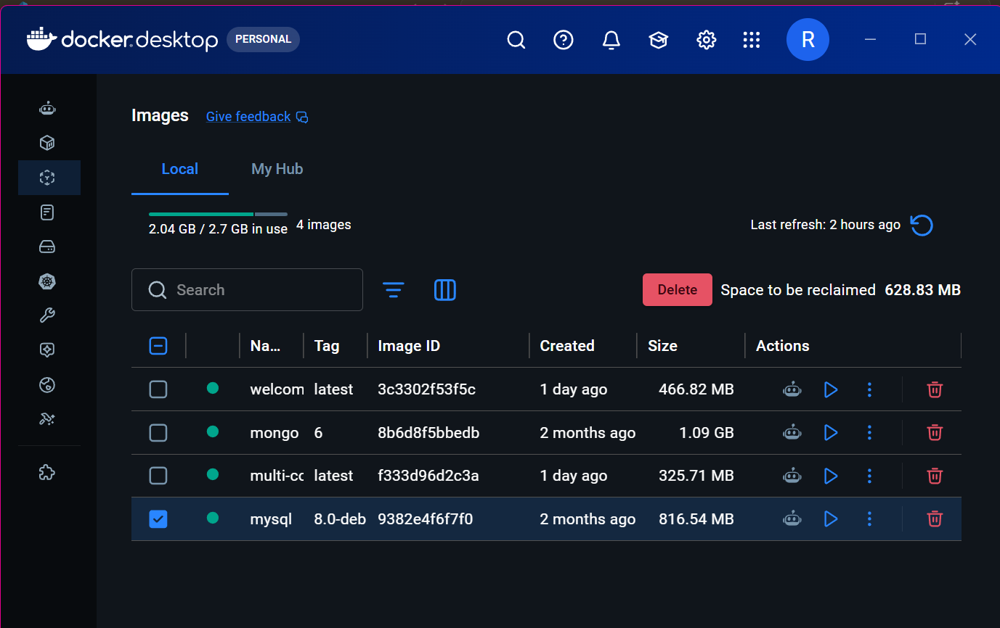
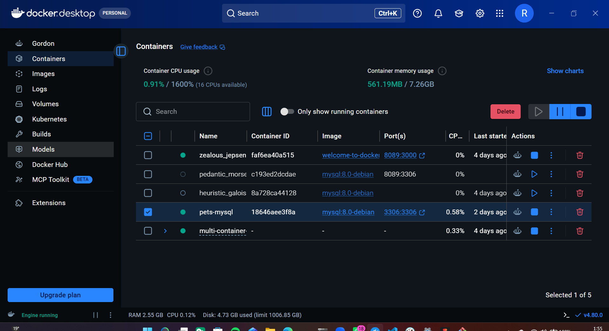
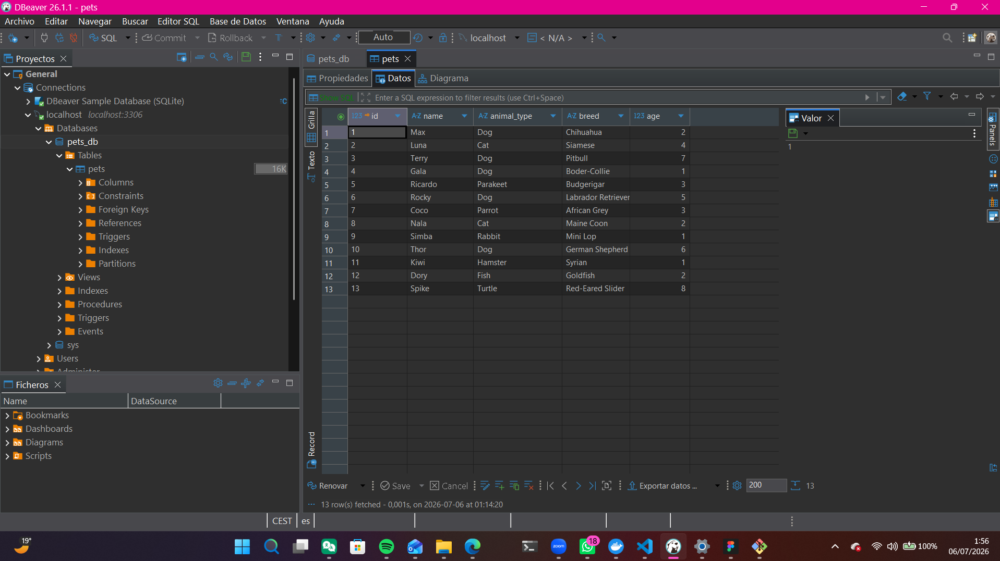
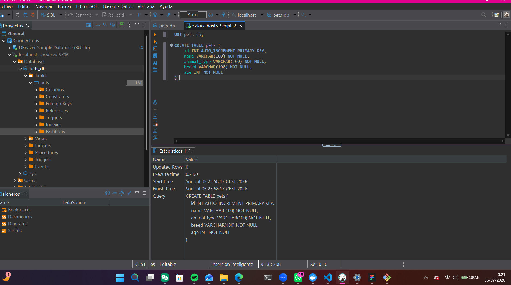
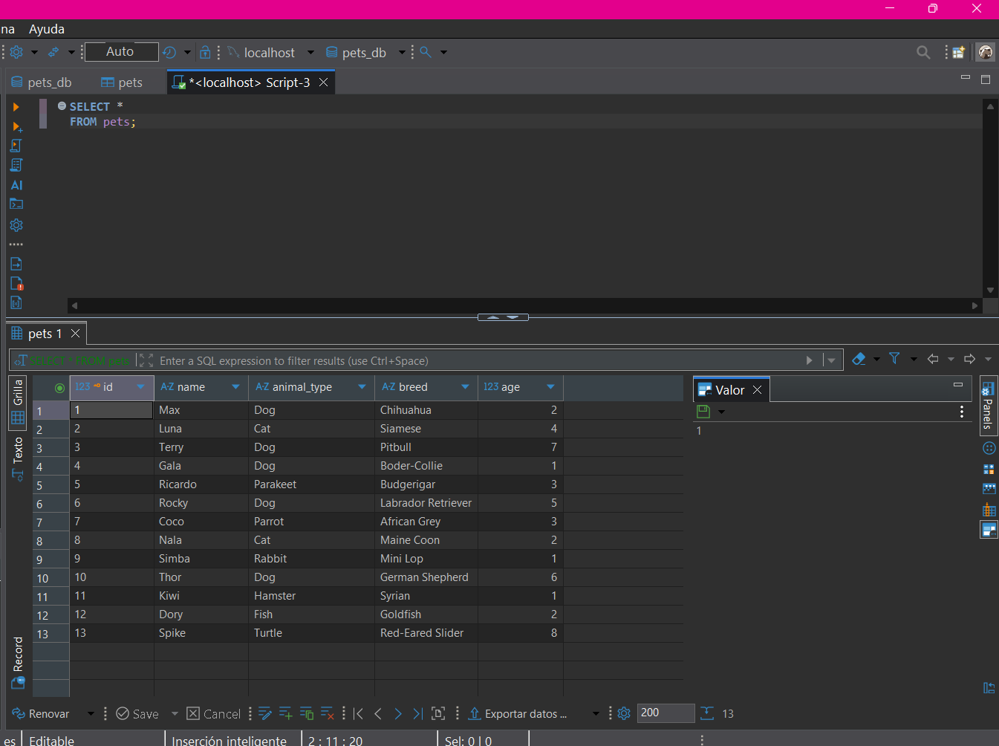
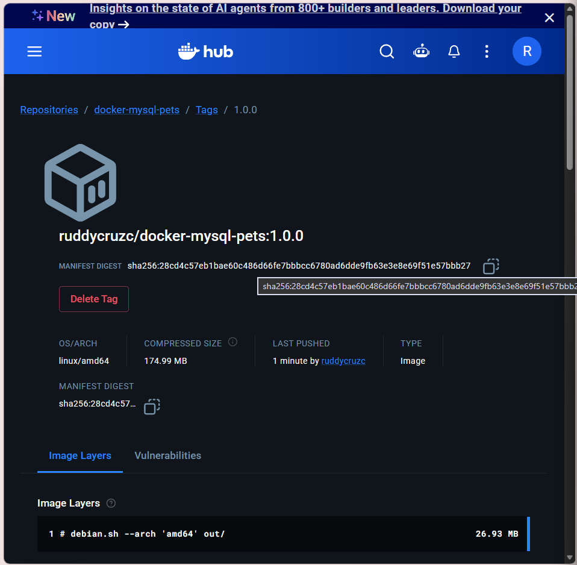
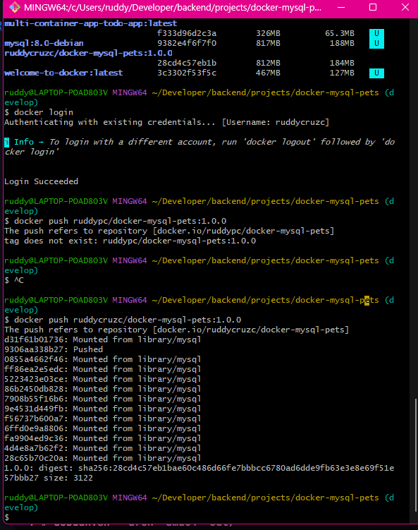

<div align="center">


# Docker MySQL Pets

Hands-on Docker and MySQL project developed during the **Full Stack Java Bootcamp**.

<br>


<br><br>

</div>

---

# Project Information

| Property | Value |
|-----------|-------|
| **Project** | Docker MySQL Pets |
| **Version** | 1.0.0 |
| **Status** | Completed |
| **Bootcamp** | Full Stack Java |
| **Repository Type** | Academic Project |
| **Maintainer** | Ruddy P. Cruz Campoverde |

---

# Tech Stack

| Technology | Purpose |
|------------|---------|
| [](https://skillicons.dev) Docker Desktop | Container management |
| [](https://skillicons.dev) MySQL 8.0 Debian | Relational database |
| [](https://skillicons.dev) DBeaver | Database management |
| [](https://skillicons.dev) Git | Version control |
| [](https://skillicons.dev) GitHub | Source code hosting |
| [](https://skillicons.dev) Visual Studio Code | Development environment |
---
# Overview

### 🇬🇧 English

This project was developed as part of the **Full Stack Java Bootcamp** to learn the fundamentals of Docker, MySQL and relational databases.

At first, the project looked simple: download an image, create a container and connect to MySQL. Then reality appeared... Docker, DBeaver, SQL scripts, Docker Hub and a few "why is this not working?" moments joined the party.

After rebuilding the project more than once (let's call it an intensive learning strategy rather than a mistake), every step started to make sense. The final result is a complete workflow that creates a MySQL container, manages a relational database using SQL scripts and publishes a custom Docker image to Docker Hub.

The repository follows software development best practices by organizing SQL scripts, documenting every step and versioning the project with Git.

### 🇪🇸 Español

Este proyecto fue desarrollado como parte del **Bootcamp Full Stack Java** para aprender los fundamentos de Docker, MySQL y las bases de datos relacionales.

Al principio parecía sencillo: descargar una imagen, crear un contenedor y conectarlo a MySQL. Después apareció la realidad... Docker, DBeaver, scripts SQL, Docker Hub y unos cuantos momentos de *"¿por qué esto no funciona?"* se unieron a la fiesta.

Tras reconstruir el proyecto más de una vez (prefiero llamarlo una estrategia intensiva de aprendizaje antes que un error), cada paso empezó a tener sentido. El resultado final es un flujo completo para crear un contenedor MySQL, gestionar una base de datos mediante scripts SQL y publicar una imagen personalizada en Docker Hub.

El repositorio sigue buenas prácticas de desarrollo organizando los scripts SQL, documentando cada paso y utilizando Git para mantener el historial del proyecto.

# Objectives

| ID | Description | Status |
|----|-------------|:------:|
| OBJ-01 | Download MySQL Docker image | ✅ |
| OBJ-02 | Create Docker container | ✅ |
| OBJ-03 | Connect DBeaver | ✅ |
| OBJ-04 | Create database | ✅ |
| OBJ-05 | Create pets table | ✅ |
| OBJ-06 | Insert sample data | ✅ |
| OBJ-07 | Execute SQL query | ✅ |
| OBJ-08 | Publish image to Docker Hub | ✅ |

---

# Project Structure

```
docker-mysql-pets
├─ README.md
├─ screenshots
│  ├─ create-table-dbeaver.png
│  ├─ dbeaver-database.png
│  ├─ docker-containers.png
│  ├─ docker-images.png
│  ├─ dockerhub-repository.png
│  ├─ git.png
│  └─ sql-query-result.png
└─ sql
   ├─ 01_create_database.sql
   ├─ 02_create_table.sql
   ├─ 03_insert_data.sql
   └─ 04_queries.sql

```

---

# Development Workflow

| Step | Description |
|------|-------------|
| 1 | Create Docker container |
| 2 | Create database |
| 3 | Create table |
| 4 | Insert sample data |
| 5 | Validate SQL queries |
| 6 | Publish Docker image |

---

# Implementation

## DMP-2 | Download MySQL Docker Image

The official MySQL 8.0 Debian image was downloaded from Docker Hub using the following command:

```bash
docker pull mysql:8.0-debian
```

---

## DMP-3 | Create MySQL Container

A new MySQL container was created exposing port **3306** and configuring the root password.

```bash
docker run --name pets-mysql \
-p 3306:3306 \
-e MYSQL_ROOT_PASSWORD=******** \
-d mysql:8.0-debian
```

The container was successfully started in detached mode and verified using Docker Desktop and the `docker ps` command.

---

# Project Evidence

## Docker Images



---

## Docker Containers



---

## Database created in DBeaver



---
## Create a table in the database with DBeaver




---
## SQL Query Result



---

## Docker Hub Repository



---
## Git evidence



---

# Docker Hub

Repository:

```text
ruddycruzc/docker-mysql-pets:1.0.0
```

---

# Learning Outcomes

### 🇬🇧 English

After completing this project I can confidently say that:

- I now understand the difference between a Docker image and a container (they are definitely not the same thing).
- Docker images are much easier to manage than my own patience during the first attempts.
- SQL only complains when you deserve it... most of the time.
- DBeaver became much friendlier once I stopped fighting it.
- Repeating the project several times turned confusion into understanding.
- I learned how to create and manage MySQL containers using Docker.
- I can create relational databases, tables and SQL scripts from scratch.
- I understand how to insert, query and validate information using SQL.
- I learned how to publish a custom Docker image to Docker Hub.
- I reinforced good development practices using Git, GitHub, Jira and structured documentation.

### 🇪🇸 Español

Después de completar este proyecto puedo decir con seguridad que:

- Ahora entiendo la diferencia entre una imagen y un contenedor en Docker (sí, definitivamente no son lo mismo).
- Las imágenes de Docker son bastante más fáciles de controlar que mi paciencia durante los primeros intentos.
- SQL solo protesta cuando realmente tiene motivos... casi siempre.
- DBeaver empezó a caerme mejor en cuanto dejé de pelearme con él.
- Repetir el proyecto varias veces consiguió que la confusión terminara convirtiéndose en comprensión.
- Aprendí a crear y gestionar contenedores MySQL utilizando Docker.
- Soy capaz de crear bases de datos, tablas y scripts SQL desde cero.
- Entiendo cómo insertar, consultar y validar información mediante SQL.
- Aprendí a publicar una imagen personalizada en Docker Hub.
- Reforcé buenas prácticas utilizando Git, GitHub, Jira y una documentación estructurada.

#  Author

| Name | GitHub |
|------|--------|
| **Ruddy P. Cruz Campoverde** | https://github.com/ruddycruzc |

---

## 💬 Developer's Note | Nota del desarrollador

> **🇬🇧 English**
>
> No containers were harmed during the development of this project.
>
> My patience, however, was restarted several times.
>
> I didn't rebuild this project three times because it failed.
> I rebuilt it three times because every new attempt taught me something the previous one hadn't.
>
> Sometimes the best way to understand Docker isn't reading another tutorial... it's accidentally breaking it and learning how to put all the pieces back together.

---

> **🇪🇸 Español**
>
> Ningún contenedor sufrió daños durante el desarrollo de este proyecto.
>
> Mi paciencia, sin embargo, tuvo que reiniciarse unas cuantas veces.
>
> No reconstruí este proyecto tres veces porque hubiera salido mal.
> Lo reconstruí tres veces porque cada nuevo intento me enseñó algo que el anterior todavía no había conseguido comprender.
>
> A veces la mejor forma de aprender Docker no es leer otro tutorial... sino romper algo por accidente y aprender a reconstruirlo pieza a pieza.
